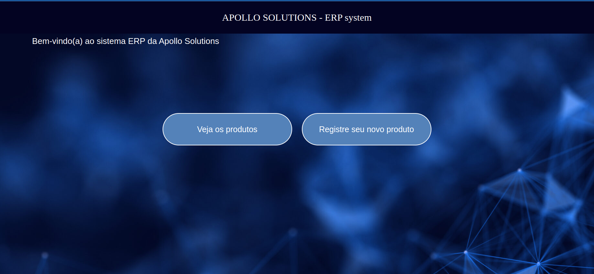
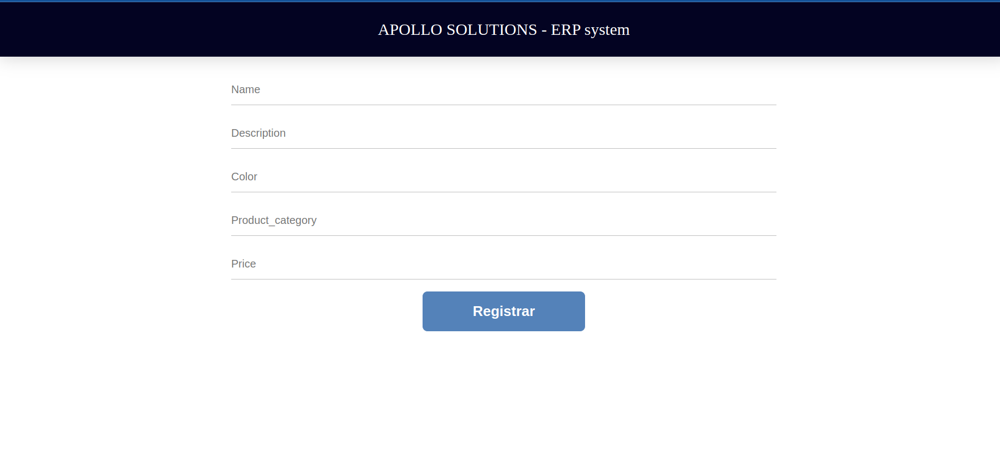
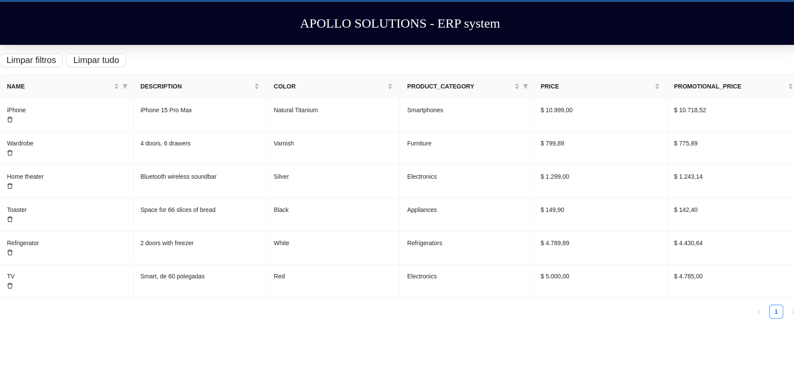

# ERP system - Apollo Solutions
_This project consists of implementing an ERP system for customers to register new products. The idea is to allow new products to be registered in the customer's ERP system, including all the product details and the discount that each product category will receive._. 

<table>
  <tr>
    <td align="center">
      
      <br />
      Home page
    </td>
  </tr>
  <tr>
    <td align="center">
      
      <br />
      Register page
    </td>
  </tr>
  <tr>
    <td align="center">
      
      <br />
      Tables page
    </td>
  </tr>
</table>
Try it in deploy at: <a href="https://erp-system-apollo.vercel.app/">ERP-System</a>

Try it in API at: https://erp-system-api.onrender.com

# Backend
## About this project
The ERP system is a powerful REST API designed to be a place for registering new products. With it, you can register products as you wish and receive the discounted price through each registered product category.

The highlighted features? It includes:

- **Health** (`/health`) 
  - A route for testing the application's health.

- **Prodcuts** (`/products`) 
  - Products creation:
    - Products can be created by the customer, containing name, description, color, product category, price, and promotional price based on a category-based promotion table.

  - List products:
    - All created products can be viewed.

  - Delete products:
    - Products can be deleted by their own ID.
    
## Why
This project has been a tremendous source of motivation for me due to its comprehensive nature. It encompasses a fully developed Node.js API framework, which is highly relevant and powerful technology. This endeavor has provided me with a deep understanding of this technology and the intricate art of creating a robust REST API.

Enterprise Resource Planning (ERP) is a software system that helps you manage the entire business by supporting automation and processes in finance, human resources, production, supply chain, services, procurement, and more.

In summary, this project has given me a valuable learning experience, allowing me to delve into Node.js, understand and navigate the complexities of an ERP, all within the context of an API.

## Technologies
The following badges represent the tools and technologies used in the project:

- [](https://nodejs.org/)

- [](https://expressjs.com/)

- [](https://www.typescriptlang.org/)

- [](https://www.postgresql.org/)

- [](https://www.prisma.io/)

- [](https://jestjs.io/)

- [](https://github.com/visionmedia/supertest)

- [](https://www.docker.com/)
 

## How to run for development

1. Clone this repository
2. Install all dependencies

```bash
$ npm i
```

3. Now you can run through the deploy, the link is further up.

4. Create a PostgreSQL database with whatever name you want

5. Configure the `.env.development` file using the `.env.example` file as a basis

6. Run your database with Prisma:

```bash
# prisma create DB and migrations
$ npm run migration:generate

# prisma deploy
$ npm run migration:run

# seed
$ npm run dev:seed
```

7. Start the server, running in the development environment:

```bash
# build
$ npm run build

# development
$ npm run dev
```

## How to run tests

1. Follow the steps in the last section
2.Configure the `.env.test` file using `.env.example` file as a basis
3. Run your database with prisma:

```bash
# prisma create DB and migrations
$ npm run test:migration:generate

# prisma deploy
$ npm run test:migration:run
```

4. Runing tests:

```bash
# integration tests
$ npm run test

# coverage
$ npm run test:coverage
```

# Frontend

## About this project

This project is a web application based on React with Vite, offering features for managing and showcasing various products. It provides functionalities such as product registration, viewing all products, and the ability to filter and sort products as needed. Users can register new products, access a registration form, and view a table displaying all products. The table allows users to apply filters, sort the products, and delete entries as required:

  - **Home** (`/`)
    - Users have the option to register new products or view information about all products and filter as desired.

  - **Register** (`/register`)
    - Registration form.

  - **Tables** (`/tables`)
    - View all products in a table, with the ability to filter, sort, and delete values.

## Technologies
The following topics represent the tools and technologies used in the project's construction:

- [](https://reactjs.org/)

- [](https://axios-http.com/)

- [](https://styled-components.com/)

- [](https://reactrouter.com/)

- [](https://vitejs.dev/)

- [](https://www.npmjs.com/package/react-toastify)

- [](https://www.npmjs.com/package/antd)

- [](https://eslint.org/)

- [](https://www.docker.com/)

## How to run for development

1. Clone this repository
2. Install all dependencies

```bash
npm i
```

3. Populate the `.env` file based on`.env.example`. The `VITE_API_BASE_URL` should follow the instructions provided in the file

4. Running the front-end in a development environment:

```bash
npm run dev
```

### Building and launching for production.

```bash
npm run build
npm preview
```

6. Using the ESLint tool for code formatting:

```bash
#Using the ESLint tool for code linting and error detection
npm run lint

#Using the ESLint tool to fix possible errors
npm run lint:fix
```

## How to run the project with Docker

1. If you don't have Docker installed, you need to install it on your machine first. Visit [docker](https://www.docker.com/) for more information.

### Building the image and running:

2. Everything through the `docker-compose` file, and for this, it is necessary that the `.env.development` file is configured as specified above and the mapped ports are available.

3. Run the `docker-compose` file on the main repository file:
```bash
# With logs
docker compose up

# Without logs
docker compose up -d
```

4. The application will be accessible at `http://localhost:8080` in your browser, as per the port mapped in the YAML file.

## Questions

1. **What would be your first improvements if you had more implementation time?**
  - **User Registration, Login, and Token Handling**: Implementing user registration and authentication, along with token-based authorization, is a fundamental security and user management improvement. This would ensure that only authenticated users can access protected routes. Implemented more routes and details to the frontend, such as the application's main page.

  - **Additional Testing**: Expanding the test suite, including unit tests to thoroughly validate business rules and services, is a good practice for maintaining code quality and reliability. Also add tests to the frontend.

  - **Caching for Database Performance**: Caching with a tool like Redis can significantly improve API performance by reducing the load on the database. This optimization can lead to faster response times and better scalability.

  - **Comprehensive Documentation**: Creating thorough API documentation, including explanations of features and required data formats, is valuable for both internal and external users. It makes it easier for developers to understand and interact with your API.

2. **Thinking about your solution, how would maintenance be in case of adding new product categories? What would need to be changed?**
  - It would be a minor update, meaning that only two changes would be needed. First, in the `schema.prisma` file, you would add the new values to the **enum ProductCategory** object, then all the typing and values ​​would be added correctly. In the `product-schema.ts` file, you would add the new category values to the **valid()** function of Joi, following the existing pattern for the object. Then, the change would involve validating the incoming request.

3. **What changes would need to be made to support updates in the product category's discount percentage so that whenever the discount percentage was changed, the new price would be reflected in all products of the same category?**
  - **Price Recalculation for Products:** Whenever the discount percentage for a category is changed, you will need to recalculate the prices of all products that belong to that category. This can be done through a batch process that iterates through all products in the category and updates their prices based on the new discount percentage.

  - **Updating the Discount Percentage for the Category:** This could be achieved through a function or endpoint in the API that allows the update of the discount percentage for a specific category. This function or endpoint should be accessible only to authorized users.

  - **Storing the Discount Percentage:** You need a way to store the discount percentage for each category. One option would be to use a database where these discount values are stored. This will allow you to access these discount values when calculating product prices.

## Support

Node is an open-source project licensed under MIT. It can grow thanks to sponsors and the support of incredible supporters. If you would like to join them, please [read more here](https://nodesource.com/services/support).

## Contact

- Author - [Kamil Myśliwiec](https://kamilmysliwiec.com)
- Website - [https://nestjs.com](https://nestjs.com/)
- Twitter - [@nestframework](https://twitter.com/nestframework)

## Licença

This project is [MIT licensed](LICENSE)